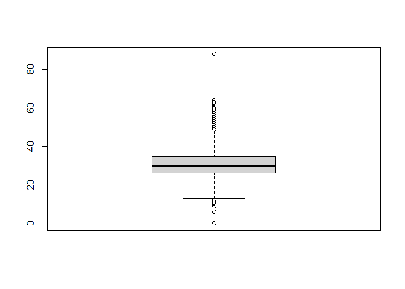
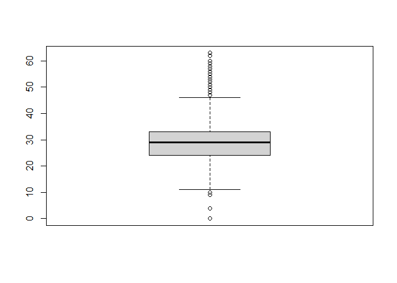
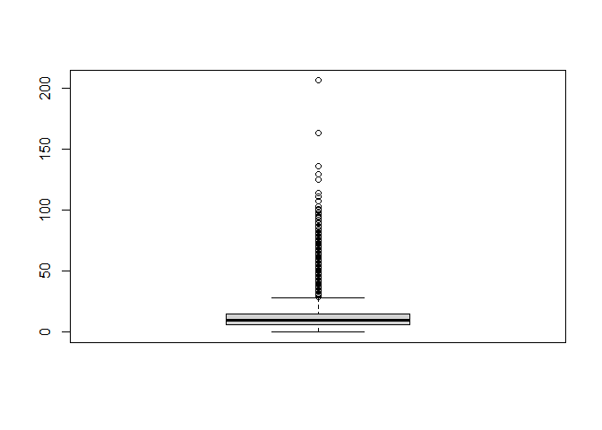

R Notebook
================

``` r
#nejake kniznice
library(dplyr)
```

    ## Warning: package 'dplyr' was built under R version 4.0.4

    ## 
    ## Attaching package: 'dplyr'

    ## The following objects are masked from 'package:stats':
    ## 
    ##     filter, lag

    ## The following objects are masked from 'package:base':
    ## 
    ##     intersect, setdiff, setequal, union

``` r
library(tidyverse)
```

    ## Warning: package 'tidyverse' was built under R version 4.0.4

    ## -- Attaching packages --------------------------------------- tidyverse 1.3.0 --

    ## <U+221A> ggplot2 3.3.3     <U+221A> purrr   0.3.4
    ## <U+221A> tibble  3.1.0     <U+221A> stringr 1.4.0
    ## <U+221A> tidyr   1.1.2     <U+221A> forcats 0.5.1
    ## <U+221A> readr   1.4.0

    ## Warning: package 'ggplot2' was built under R version 4.0.4

    ## Warning: package 'tibble' was built under R version 4.0.4

    ## Warning: package 'tidyr' was built under R version 4.0.4

    ## Warning: package 'readr' was built under R version 4.0.4

    ## Warning: package 'purrr' was built under R version 4.0.4

    ## Warning: package 'stringr' was built under R version 4.0.3

    ## Warning: package 'forcats' was built under R version 4.0.4

    ## -- Conflicts ------------------------------------------ tidyverse_conflicts() --
    ## x dplyr::filter() masks stats::filter()
    ## x dplyr::lag()    masks stats::lag()

``` r
library(data.table)
```

    ## Warning: package 'data.table' was built under R version 4.0.4

    ## 
    ## Attaching package: 'data.table'

    ## The following object is masked from 'package:purrr':
    ## 
    ##     transpose

    ## The following objects are masked from 'package:dplyr':
    ## 
    ##     between, first, last

\#\#Dáta

\#\#\#Tabuľka game Tabuľka obsahuje základné dáta jednotlivých zápasov.
Neobsahuje však detailné informácie o tímoch alebo tímových štatistikách
konkrétneho zápasu. Dokážeme však pomocou atribútov game\_id,
away\_team\_id a home\_team\_id namapovať iné tabuľky tak, aby sme
dostali jeden dataset so všetkými hodnotami.

``` r
#setwd(dir) 
path <- ('data/game.csv')
game <- fread(path)
head(game)
```

    ##       game_id   season type       date_time_GMT away_team_id home_team_id
    ## 1: 2016020045 20162017    R 2016-10-19 00:30:00            4           16
    ## 2: 2017020812 20172018    R 2018-02-07 00:00:00           24            7
    ## 3: 2015020314 20152016    R 2015-11-24 01:00:00           21           52
    ## 4: 2015020849 20152016    R 2016-02-17 00:00:00           52           12
    ## 5: 2017020586 20172018    R 2017-12-30 03:00:00           20           24
    ## 6: 2016020610 20162017    R 2017-01-10 00:30:00           15            8
    ##    away_goals home_goals      outcome home_rink_side_start          venue
    ## 1:          4          7 home win REG                right  United Center
    ## 2:          4          3  away win OT                 left KeyBank Center
    ## 3:          4          1 away win REG                right     MTS Centre
    ## 4:          1          2 home win REG                right      PNC Arena
    ## 5:          1          2 home win REG                 left   Honda Center
    ## 6:          4          1 away win REG                right    Centre Bell
    ##             venue_link  venue_time_zone_id venue_time_zone_offset
    ## 1: /api/v1/venues/null     America/Chicago                     -5
    ## 2: /api/v1/venues/null    America/New_York                     -4
    ## 3: /api/v1/venues/null    America/Winnipeg                     -5
    ## 4: /api/v1/venues/null    America/New_York                     -4
    ## 5: /api/v1/venues/null America/Los_Angeles                     -7
    ## 6: /api/v1/venues/null    America/Montreal                     -4
    ##    venue_time_zone_tz
    ## 1:                CDT
    ## 2:                EDT
    ## 3:                CDT
    ## 4:                EDT
    ## 5:                PDT
    ## 6:                EDT

Niektoré atribúty sú z pohľadu štatistiky nezaujímavé a teda ich môžeme
odstrániť pred spájaním tabuliek. Napríklad údaje o časovej zóne, alebo
identifikátory štadiónov a pod.

``` r
game <- subset(game, select=-c(venue_link,venue_time_zone_id, venue_time_zone_offset, venue_time_zone_tz))
head(game)
```

    ##       game_id   season type       date_time_GMT away_team_id home_team_id
    ## 1: 2016020045 20162017    R 2016-10-19 00:30:00            4           16
    ## 2: 2017020812 20172018    R 2018-02-07 00:00:00           24            7
    ## 3: 2015020314 20152016    R 2015-11-24 01:00:00           21           52
    ## 4: 2015020849 20152016    R 2016-02-17 00:00:00           52           12
    ## 5: 2017020586 20172018    R 2017-12-30 03:00:00           20           24
    ## 6: 2016020610 20162017    R 2017-01-10 00:30:00           15            8
    ##    away_goals home_goals      outcome home_rink_side_start          venue
    ## 1:          4          7 home win REG                right  United Center
    ## 2:          4          3  away win OT                 left KeyBank Center
    ## 3:          4          1 away win REG                right     MTS Centre
    ## 4:          1          2 home win REG                right      PNC Arena
    ## 5:          1          2 home win REG                 left   Honda Center
    ## 6:          4          1 away win REG                right    Centre Bell

``` r
dim(game)
```

    ## [1] 26305    11

Prvotnou analýzou sme zistili, že v minulej sezóne sa odohralo približne
2500 zápasov, z čoho bolo +-10 percent v playoff. S týmto počtom zápasov
nám stačí pracovať s poslednou sezónov pri trénovaní stroja.

``` r
dim(game[game$season==20192020,])
```

    ## [1] 2425   11

``` r
dim(subset(game, season==20192020 & type=='P'))
```

    ## [1] 231  11

``` r
#game <- game[!(outcome %like% "tbc")]
```

Počet hier v minulej sezóne bol omnoho vyšší ako je zvykom, tak sme
skontrolovali existenciu duplikátnych záznamov v tabuľke. Z výpisu
nižšie sme odhalili 2570 duplikátov v celej tabuľke.

``` r
game[duplicated(game)]
```

    ##          game_id   season type       date_time_GMT away_team_id home_team_id
    ##    1: 2019020001 20192020    R 2019-10-02 23:00:00            9           10
    ##    2: 2019020002 20192020    R 2019-10-03 00:00:00           15           19
    ##    3: 2019020003 20192020    R 2019-10-03 02:00:00           23           22
    ##    4: 2019020004 20192020    R 2019-10-03 02:30:00           28           54
    ##    5: 2019020005 20192020    R 2019-10-03 23:00:00           13           14
    ##   ---                                                                       
    ## 2566: 2018030413 20182019    P 2019-06-02 00:00:00            6           19
    ## 2567: 2018030414 20182019    P 2019-06-04 00:00:00            6           19
    ## 2568: 2018030415 20182019    P 2019-06-07 00:00:00           19            6
    ## 2569: 2018030416 20182019    P 2019-06-10 00:00:00            6           19
    ## 2570: 2018030417 20182019    P 2019-06-13 00:00:00           19            6
    ##       away_goals home_goals      outcome home_rink_side_start             venue
    ##    1:          3          5 home win REG                right  Scotiabank Arena
    ##    2:          3          2  away win OT                 left Enterprise Center
    ##    3:          2          3 home win REG                 left      Rogers Place
    ##    4:          1          4 home win REG                 <NA>    T-Mobile Arena
    ##    5:          2          5 home win REG                 left      Amalie Arena
    ##   ---                                                                          
    ## 2566:          7          2 away win REG                 left Enterprise Center
    ## 2567:          2          4 home win REG                 left Enterprise Center
    ## 2568:          2          1 away win REG                 left         TD Garden
    ## 2569:          5          1 away win REG                 left Enterprise Center
    ## 2570:          4          1 away win REG                 left         TD Garden

Aby sme si overili existenciu duplikátov, tak sme si vypísali náhodnú
hru z vyššie vygenerovanej tabuľky duplikátov.

``` r
game[game$game_id==2019020369]
```

    ##       game_id   season type date_time_GMT away_team_id home_team_id away_goals
    ## 1: 2019020369 20192020    R    2019-11-26            9           29          0
    ## 2: 2019020369 20192020    R    2019-11-26            9           29          0
    ##    home_goals      outcome home_rink_side_start            venue
    ## 1:          1 home win REG                 left Nationwide Arena
    ## 2:          1 home win REG                 left Nationwide Arena

Duplikáty sme eliminovali využitím funkcie distinct, ktorá zachová
jedinečné záznamy. Elimináciu duplikátov sme overili opäť použitím
funkcie duplicated, ktorá vrátila 0 záznamov. Počet záznamov v tabuľke
klesol o 2570, aktuálny počet záznamov je teda 23735.

``` r
game <- distinct(game)
game[duplicated(game)]
```

    ## Empty data.table (0 rows and 11 cols): game_id,season,type,date_time_GMT,away_team_id,home_team_id...

``` r
dim(game)
```

    ## [1] 23735    11

\#\#\#Tabuľka game\_teams\_stats

``` r
path <- ('data/game_teams_stats.csv')
game_teams_stats <- fread(path)
head(game_teams_stats)
```

    ##       game_id team_id  HoA   won settled_in       head_coach goals shots hits
    ## 1: 2016020045       4 away FALSE        REG     Dave Hakstol     4    27   30
    ## 2: 2016020045      16 home  TRUE        REG Joel Quenneville     7    28   20
    ## 3: 2017020812      24 away  TRUE         OT    Randy Carlyle     4    34   16
    ## 4: 2017020812       7 home FALSE         OT     Phil Housley     3    33   17
    ## 5: 2015020314      21 away  TRUE        REG      Patrick Roy     4    29   17
    ## 6: 2015020314      52 home FALSE        REG     Paul Maurice     1    21   22
    ##    pim powerPlayOpportunities powerPlayGoals faceOffWinPercentage giveaways
    ## 1:   6                      4              2                 50.9        12
    ## 2:   8                      3              2                 49.1        16
    ## 3:   6                      3              1                 43.8         7
    ## 4:   8                      2              1                 56.2         5
    ## 5:   9                      3              1                 45.7        13
    ## 6:  11                      2              0                 54.3        13
    ##    takeaways blocked startRinkSide
    ## 1:         9      11          left
    ## 2:         8       9          left
    ## 3:         4      14         right
    ## 4:         6      14         right
    ## 5:         5      20          left
    ## 6:         7       9          left

``` r
game_teams_stats <- subset(game_teams_stats, select=-c(head_coach, startRinkSide, goals))
head(game_teams_stats)
```

    ##       game_id team_id  HoA   won settled_in shots hits pim
    ## 1: 2016020045       4 away FALSE        REG    27   30   6
    ## 2: 2016020045      16 home  TRUE        REG    28   20   8
    ## 3: 2017020812      24 away  TRUE         OT    34   16   6
    ## 4: 2017020812       7 home FALSE         OT    33   17   8
    ## 5: 2015020314      21 away  TRUE        REG    29   17   9
    ## 6: 2015020314      52 home FALSE        REG    21   22  11
    ##    powerPlayOpportunities powerPlayGoals faceOffWinPercentage giveaways
    ## 1:                      4              2                 50.9        12
    ## 2:                      3              2                 49.1        16
    ## 3:                      3              1                 43.8         7
    ## 4:                      2              1                 56.2         5
    ## 5:                      3              1                 45.7        13
    ## 6:                      2              0                 54.3        13
    ##    takeaways blocked
    ## 1:         9      11
    ## 2:         8       9
    ## 3:         4      14
    ## 4:         6      14
    ## 5:         5      20
    ## 6:         7       9

``` r
dim(game_teams_stats)
```

    ## [1] 52610    14

``` r
length(unique(game_teams_stats$game_id))
```

    ## [1] 23735

# 

``` r
path <- ('data/team_info.csv')
team_info <- fread(path)
head(team_info)
```

    ##    team_id franchiseId    shortName  teamName abbreviation             link
    ## 1:       1          23   New Jersey    Devils          NJD  /api/v1/teams/1
    ## 2:       4          16 Philadelphia    Flyers          PHI  /api/v1/teams/4
    ## 3:      26          14  Los Angeles     Kings          LAK /api/v1/teams/26
    ## 4:      14          31    Tampa Bay Lightning          TBL /api/v1/teams/14
    ## 5:       6           6       Boston    Bruins          BOS  /api/v1/teams/6
    ## 6:       3          10   NY Rangers   Rangers          NYR  /api/v1/teams/3

``` r
team_info <- subset(team_info, select=-c(franchiseId, link, shortName, teamName))
head(team_info)
```

    ##    team_id abbreviation
    ## 1:       1          NJD
    ## 2:       4          PHI
    ## 3:      26          LAK
    ## 4:      14          TBL
    ## 5:       6          BOS
    ## 6:       3          NYR

``` r
dim(team_info)
```

    ## [1] 33  2

# 

``` r
game_teams_stats <- left_join(game_teams_stats, team_info, "team_id")
head(game_teams_stats)
```

    ##       game_id team_id  HoA   won settled_in shots hits pim
    ## 1: 2016020045       4 away FALSE        REG    27   30   6
    ## 2: 2016020045      16 home  TRUE        REG    28   20   8
    ## 3: 2017020812      24 away  TRUE         OT    34   16   6
    ## 4: 2017020812       7 home FALSE         OT    33   17   8
    ## 5: 2015020314      21 away  TRUE        REG    29   17   9
    ## 6: 2015020314      52 home FALSE        REG    21   22  11
    ##    powerPlayOpportunities powerPlayGoals faceOffWinPercentage giveaways
    ## 1:                      4              2                 50.9        12
    ## 2:                      3              2                 49.1        16
    ## 3:                      3              1                 43.8         7
    ## 4:                      2              1                 56.2         5
    ## 5:                      3              1                 45.7        13
    ## 6:                      2              0                 54.3        13
    ##    takeaways blocked abbreviation
    ## 1:         9      11          PHI
    ## 2:         8       9          CHI
    ## 3:         4      14          ANA
    ## 4:         6      14          BUF
    ## 5:         5      20          COL
    ## 6:         7       9          WPG

``` r
dim(game_teams_stats)
```

    ## [1] 52610    15

``` r
length(unique(game_teams_stats$team_id))
```

    ## [1] 37

``` r
df_h <- game_teams_stats[(game_teams_stats$HoA == 'home'),]
head(df_h)
```

    ##       game_id team_id  HoA   won settled_in shots hits pim
    ## 1: 2016020045      16 home  TRUE        REG    28   20   8
    ## 2: 2017020812       7 home FALSE         OT    33   17   8
    ## 3: 2015020314      52 home FALSE        REG    21   22  11
    ## 4: 2015020849      12 home  TRUE        REG    29   16   8
    ## 5: 2017020586      24 home  TRUE        REG    41   15  13
    ## 6: 2016020610       8 home FALSE        REG    23   27   4
    ##    powerPlayOpportunities powerPlayGoals faceOffWinPercentage giveaways
    ## 1:                      3              2                 49.1        16
    ## 2:                      2              1                 56.2         5
    ## 3:                      2              0                 54.3        13
    ## 4:                      5              2                 68.6        12
    ## 5:                      6              1                 45.3        13
    ## 6:                      4              1                 53.4        12
    ##    takeaways blocked abbreviation
    ## 1:         8       9          CHI
    ## 2:         6      14          BUF
    ## 3:         7       9          WPG
    ## 4:        11      13          CAR
    ## 5:         4      21          ANA
    ## 6:         7      18          MTL

``` r
dim(df_h)
```

    ## [1] 26305    15

``` r
df_h <- distinct(df_h)
unique(df_h$HoA)
```

    ## [1] "home"

``` r
df_a <- game_teams_stats[(game_teams_stats$HoA == 'away'),]
head(df_a)
```

    ##       game_id team_id  HoA   won settled_in shots hits pim
    ## 1: 2016020045       4 away FALSE        REG    27   30   6
    ## 2: 2017020812      24 away  TRUE         OT    34   16   6
    ## 3: 2015020314      21 away  TRUE        REG    29   17   9
    ## 4: 2015020849      52 away FALSE        REG    21   21  10
    ## 5: 2017020586      20 away FALSE        REG    23   20  19
    ## 6: 2016020610      15 away  TRUE        REG    39   19   8
    ##    powerPlayOpportunities powerPlayGoals faceOffWinPercentage giveaways
    ## 1:                      4              2                 50.9        12
    ## 2:                      3              1                 43.8         7
    ## 3:                      3              1                 45.7        13
    ## 4:                      4              0                 31.4         4
    ## 5:                      3              0                 54.7        10
    ## 6:                      2              1                 46.6         8
    ##    takeaways blocked abbreviation
    ## 1:         9      11          PHI
    ## 2:         4      14          ANA
    ## 3:         5      20          COL
    ## 4:        14      16          WPG
    ## 5:         4       7          CGY
    ## 6:         5      24          WSH

``` r
dim(df_a)
```

    ## [1] 26305    15

``` r
df_a <- distinct(df_a)
unique(df_a$HoA)
```

    ## [1] "away"

``` r
df <- left_join(df_a, df_h, "game_id", suffix = c(".away", ".home"))
head(df)
```

    ##       game_id team_id.away HoA.away won.away settled_in.away shots.away
    ## 1: 2016020045            4     away    FALSE             REG         27
    ## 2: 2017020812           24     away     TRUE              OT         34
    ## 3: 2015020314           21     away     TRUE             REG         29
    ## 4: 2015020849           52     away    FALSE             REG         21
    ## 5: 2017020586           20     away    FALSE             REG         23
    ## 6: 2016020610           15     away     TRUE             REG         39
    ##    hits.away pim.away powerPlayOpportunities.away powerPlayGoals.away
    ## 1:        30        6                           4                   2
    ## 2:        16        6                           3                   1
    ## 3:        17        9                           3                   1
    ## 4:        21       10                           4                   0
    ## 5:        20       19                           3                   0
    ## 6:        19        8                           2                   1
    ##    faceOffWinPercentage.away giveaways.away takeaways.away blocked.away
    ## 1:                      50.9             12              9           11
    ## 2:                      43.8              7              4           14
    ## 3:                      45.7             13              5           20
    ## 4:                      31.4              4             14           16
    ## 5:                      54.7             10              4            7
    ## 6:                      46.6              8              5           24
    ##    abbreviation.away team_id.home HoA.home won.home settled_in.home shots.home
    ## 1:               PHI           16     home     TRUE             REG         28
    ## 2:               ANA            7     home    FALSE              OT         33
    ## 3:               COL           52     home    FALSE             REG         21
    ## 4:               WPG           12     home     TRUE             REG         29
    ## 5:               CGY           24     home     TRUE             REG         41
    ## 6:               WSH            8     home    FALSE             REG         23
    ##    hits.home pim.home powerPlayOpportunities.home powerPlayGoals.home
    ## 1:        20        8                           3                   2
    ## 2:        17        8                           2                   1
    ## 3:        22       11                           2                   0
    ## 4:        16        8                           5                   2
    ## 5:        15       13                           6                   1
    ## 6:        27        4                           4                   1
    ##    faceOffWinPercentage.home giveaways.home takeaways.home blocked.home
    ## 1:                      49.1             16              8            9
    ## 2:                      56.2              5              6           14
    ## 3:                      54.3             13              7            9
    ## 4:                      68.6             12             11           13
    ## 5:                      45.3             13              4           21
    ## 6:                      53.4             12              7           18
    ##    abbreviation.home
    ## 1:               CHI
    ## 2:               BUF
    ## 3:               WPG
    ## 4:               CAR
    ## 5:               ANA
    ## 6:               MTL

``` r
dim(df)
```

    ## [1] 23735    29

``` r
df <- left_join(game, df, "game_id")
head(df)
```

    ##       game_id   season type       date_time_GMT away_team_id home_team_id
    ## 1: 2016020045 20162017    R 2016-10-19 00:30:00            4           16
    ## 2: 2017020812 20172018    R 2018-02-07 00:00:00           24            7
    ## 3: 2015020314 20152016    R 2015-11-24 01:00:00           21           52
    ## 4: 2015020849 20152016    R 2016-02-17 00:00:00           52           12
    ## 5: 2017020586 20172018    R 2017-12-30 03:00:00           20           24
    ## 6: 2016020610 20162017    R 2017-01-10 00:30:00           15            8
    ##    away_goals home_goals      outcome home_rink_side_start          venue
    ## 1:          4          7 home win REG                right  United Center
    ## 2:          4          3  away win OT                 left KeyBank Center
    ## 3:          4          1 away win REG                right     MTS Centre
    ## 4:          1          2 home win REG                right      PNC Arena
    ## 5:          1          2 home win REG                 left   Honda Center
    ## 6:          4          1 away win REG                right    Centre Bell
    ##    team_id.away HoA.away won.away settled_in.away shots.away hits.away pim.away
    ## 1:            4     away    FALSE             REG         27        30        6
    ## 2:           24     away     TRUE              OT         34        16        6
    ## 3:           21     away     TRUE             REG         29        17        9
    ## 4:           52     away    FALSE             REG         21        21       10
    ## 5:           20     away    FALSE             REG         23        20       19
    ## 6:           15     away     TRUE             REG         39        19        8
    ##    powerPlayOpportunities.away powerPlayGoals.away faceOffWinPercentage.away
    ## 1:                           4                   2                      50.9
    ## 2:                           3                   1                      43.8
    ## 3:                           3                   1                      45.7
    ## 4:                           4                   0                      31.4
    ## 5:                           3                   0                      54.7
    ## 6:                           2                   1                      46.6
    ##    giveaways.away takeaways.away blocked.away abbreviation.away team_id.home
    ## 1:             12              9           11               PHI           16
    ## 2:              7              4           14               ANA            7
    ## 3:             13              5           20               COL           52
    ## 4:              4             14           16               WPG           12
    ## 5:             10              4            7               CGY           24
    ## 6:              8              5           24               WSH            8
    ##    HoA.home won.home settled_in.home shots.home hits.home pim.home
    ## 1:     home     TRUE             REG         28        20        8
    ## 2:     home    FALSE              OT         33        17        8
    ## 3:     home    FALSE             REG         21        22       11
    ## 4:     home     TRUE             REG         29        16        8
    ## 5:     home     TRUE             REG         41        15       13
    ## 6:     home    FALSE             REG         23        27        4
    ##    powerPlayOpportunities.home powerPlayGoals.home faceOffWinPercentage.home
    ## 1:                           3                   2                      49.1
    ## 2:                           2                   1                      56.2
    ## 3:                           2                   0                      54.3
    ## 4:                           5                   2                      68.6
    ## 5:                           6                   1                      45.3
    ## 6:                           4                   1                      53.4
    ##    giveaways.home takeaways.home blocked.home abbreviation.home
    ## 1:             16              8            9               CHI
    ## 2:              5              6           14               BUF
    ## 3:             13              7            9               WPG
    ## 4:             12             11           13               CAR
    ## 5:             13              4           21               ANA
    ## 6:             12              7           18               MTL

``` r
dim(df)
```

    ## [1] 23735    39

``` r
dim(df[df$season==20192020,])
```

    ## [1] 1215   39

``` r
dim(subset(df, season==20192020 & type=='P'))
```

    ## [1] 118  39

``` r
dim(df[df$season==20182019,])
```

    ## [1] 1360   39

``` r
dim(subset(df, season==20182019 & type=='P'))
```

    ## [1] 87 39

``` r
dim(df[df$season==20172018,])
```

    ## [1] 1363   39

``` r
dim(subset(df, season==20172018 & type=='P'))
```

    ## [1] 92 39

``` r
dim(df[df$season==20162017,])
```

    ## [1] 1323   39

``` r
dim(subset(df, season==20162017 & type=='P'))
```

    ## [1] 93 39

``` r
glimpse(df)
```

    ## Rows: 23,735
    ## Columns: 39
    ## $ game_id                     <int> 2016020045, 2017020812, 2015020314, 201502~
    ## $ season                      <int> 20162017, 20172018, 20152016, 20152016, 20~
    ## $ type                        <chr> "R", "R", "R", "R", "R", "R", "R", "R", "R~
    ## $ date_time_GMT               <dttm> 2016-10-19 00:30:00, 2018-02-07 00:00:00,~
    ## $ away_team_id                <int> 4, 24, 21, 52, 20, 15, 10, 23, 29, 22, 52,~
    ## $ home_team_id                <int> 16, 7, 52, 12, 24, 8, 26, 24, 21, 5, 25, 2~
    ## $ away_goals                  <int> 4, 4, 4, 1, 1, 4, 1, 1, 0, 3, 4, 2, 2, 3, ~
    ## $ home_goals                  <int> 7, 3, 1, 2, 2, 1, 2, 4, 2, 2, 1, 4, 3, 2, ~
    ## $ outcome                     <chr> "home win REG", "away win OT", "away win R~
    ## $ home_rink_side_start        <chr> "right", "left", "right", "right", "left",~
    ## $ venue                       <chr> "United Center", "KeyBank Center", "MTS Ce~
    ## $ team_id.away                <int> 4, 24, 21, 52, 20, 15, 10, 23, 29, 22, 52,~
    ## $ HoA.away                    <chr> "away", "away", "away", "away", "away", "a~
    ## $ won.away                    <lgl> FALSE, TRUE, TRUE, FALSE, FALSE, TRUE, FAL~
    ## $ settled_in.away             <chr> "REG", "OT", "REG", "REG", "REG", "REG", "~
    ## $ shots.away                  <int> 27, 34, 29, 21, 23, 39, 26, 20, 34, 36, 26~
    ## $ hits.away                   <int> 30, 16, 17, 21, 20, 19, 24, 11, 12, 31, 22~
    ## $ pim.away                    <int> 6, 6, 9, 10, 19, 8, 19, 27, 8, 8, 8, 4, 4,~
    ## $ powerPlayOpportunities.away <int> 4, 3, 3, 4, 3, 2, 4, 5, 3, 4, 3, 2, 2, 2, ~
    ## $ powerPlayGoals.away         <int> 2, 1, 1, 0, 0, 1, 1, 0, 0, 1, 1, 0, 0, 0, ~
    ## $ faceOffWinPercentage.away   <dbl> 50.9, 43.8, 45.7, 31.4, 54.7, 46.6, 56.9, ~
    ## $ giveaways.away              <int> 12, 7, 13, 4, 10, 8, 6, 13, 3, 5, 3, 12, 5~
    ## $ takeaways.away              <int> 9, 4, 5, 14, 4, 5, 2, 5, 8, 2, 2, 2, 3, 4,~
    ## $ blocked.away                <int> 11, 14, 20, 16, 7, 24, 7, 15, 14, 17, 15, ~
    ## $ abbreviation.away           <chr> "PHI", "ANA", "COL", "WPG", "CGY", "WSH", ~
    ## $ team_id.home                <int> 16, 7, 52, 12, 24, 8, 26, 24, 21, 5, 25, 2~
    ## $ HoA.home                    <chr> "home", "home", "home", "home", "home", "h~
    ## $ won.home                    <lgl> TRUE, FALSE, FALSE, TRUE, TRUE, FALSE, TRU~
    ## $ settled_in.home             <chr> "REG", "OT", "REG", "REG", "REG", "REG", "~
    ## $ shots.home                  <int> 28, 33, 21, 29, 41, 23, 41, 35, 32, 41, 34~
    ## $ hits.home                   <int> 20, 17, 22, 16, 15, 27, 23, 10, 20, 36, 22~
    ## $ pim.home                    <int> 8, 8, 11, 8, 13, 4, 10, 15, 8, 8, 6, 4, 4,~
    ## $ powerPlayOpportunities.home <int> 3, 2, 2, 5, 6, 4, 2, 6, 3, 4, 4, 2, 2, 1, ~
    ## $ powerPlayGoals.home         <int> 2, 1, 0, 2, 1, 1, 0, 3, 1, 1, 1, 0, 0, 0, ~
    ## $ faceOffWinPercentage.home   <dbl> 49.1, 56.2, 54.3, 68.6, 45.3, 53.4, 43.1, ~
    ## $ giveaways.home              <int> 16, 5, 13, 12, 13, 12, 12, 11, 5, 10, 13, ~
    ## $ takeaways.home              <int> 8, 6, 7, 11, 4, 7, 2, 6, 5, 5, 2, 2, 4, 9,~
    ## $ blocked.home                <int> 9, 14, 9, 13, 21, 18, 14, 12, 13, 12, 14, ~
    ## $ abbreviation.home           <chr> "CHI", "BUF", "WPG", "CAR", "ANA", "MTL", ~

``` r
df <- subset(df, select=-c(game_id, date_time_GMT, outcome, home_rink_side_start, venue, away_team_id, home_team_id, settled_in.away))
df <- rename(df, 'settled_in' = 'settled_in.home')
df <- rename(df, 'goals.away' = 'away_goals')
df <- rename(df, 'goals.home' = 'home_goals')
head(df)
```

    ##      season type goals.away goals.home team_id.away HoA.away won.away
    ## 1: 20162017    R          4          7            4     away    FALSE
    ## 2: 20172018    R          4          3           24     away     TRUE
    ## 3: 20152016    R          4          1           21     away     TRUE
    ## 4: 20152016    R          1          2           52     away    FALSE
    ## 5: 20172018    R          1          2           20     away    FALSE
    ## 6: 20162017    R          4          1           15     away     TRUE
    ##    shots.away hits.away pim.away powerPlayOpportunities.away
    ## 1:         27        30        6                           4
    ## 2:         34        16        6                           3
    ## 3:         29        17        9                           3
    ## 4:         21        21       10                           4
    ## 5:         23        20       19                           3
    ## 6:         39        19        8                           2
    ##    powerPlayGoals.away faceOffWinPercentage.away giveaways.away takeaways.away
    ## 1:                   2                      50.9             12              9
    ## 2:                   1                      43.8              7              4
    ## 3:                   1                      45.7             13              5
    ## 4:                   0                      31.4              4             14
    ## 5:                   0                      54.7             10              4
    ## 6:                   1                      46.6              8              5
    ##    blocked.away abbreviation.away team_id.home HoA.home won.home settled_in
    ## 1:           11               PHI           16     home     TRUE        REG
    ## 2:           14               ANA            7     home    FALSE         OT
    ## 3:           20               COL           52     home    FALSE        REG
    ## 4:           16               WPG           12     home     TRUE        REG
    ## 5:            7               CGY           24     home     TRUE        REG
    ## 6:           24               WSH            8     home    FALSE        REG
    ##    shots.home hits.home pim.home powerPlayOpportunities.home
    ## 1:         28        20        8                           3
    ## 2:         33        17        8                           2
    ## 3:         21        22       11                           2
    ## 4:         29        16        8                           5
    ## 5:         41        15       13                           6
    ## 6:         23        27        4                           4
    ##    powerPlayGoals.home faceOffWinPercentage.home giveaways.home takeaways.home
    ## 1:                   2                      49.1             16              8
    ## 2:                   1                      56.2              5              6
    ## 3:                   0                      54.3             13              7
    ## 4:                   2                      68.6             12             11
    ## 5:                   1                      45.3             13              4
    ## 6:                   1                      53.4             12              7
    ##    blocked.home abbreviation.home
    ## 1:            9               CHI
    ## 2:           14               BUF
    ## 3:            9               WPG
    ## 4:           13               CAR
    ## 5:           21               ANA
    ## 6:           18               MTL

``` r
dim(df)
```

    ## [1] 23735    31

## Prieskumná analýza datasetu

charakteristika dát, ich rozdelenie a identifikácia problémov (+
riešenie).

``` r
glimpse(df)
```

    ## Rows: 23,735
    ## Columns: 31
    ## $ season                      <int> 20162017, 20172018, 20152016, 20152016, 20~
    ## $ type                        <chr> "R", "R", "R", "R", "R", "R", "R", "R", "R~
    ## $ goals.away                  <int> 4, 4, 4, 1, 1, 4, 1, 1, 0, 3, 4, 2, 2, 3, ~
    ## $ goals.home                  <int> 7, 3, 1, 2, 2, 1, 2, 4, 2, 2, 1, 4, 3, 2, ~
    ## $ team_id.away                <int> 4, 24, 21, 52, 20, 15, 10, 23, 29, 22, 52,~
    ## $ HoA.away                    <chr> "away", "away", "away", "away", "away", "a~
    ## $ won.away                    <lgl> FALSE, TRUE, TRUE, FALSE, FALSE, TRUE, FAL~
    ## $ shots.away                  <int> 27, 34, 29, 21, 23, 39, 26, 20, 34, 36, 26~
    ## $ hits.away                   <int> 30, 16, 17, 21, 20, 19, 24, 11, 12, 31, 22~
    ## $ pim.away                    <int> 6, 6, 9, 10, 19, 8, 19, 27, 8, 8, 8, 4, 4,~
    ## $ powerPlayOpportunities.away <int> 4, 3, 3, 4, 3, 2, 4, 5, 3, 4, 3, 2, 2, 2, ~
    ## $ powerPlayGoals.away         <int> 2, 1, 1, 0, 0, 1, 1, 0, 0, 1, 1, 0, 0, 0, ~
    ## $ faceOffWinPercentage.away   <dbl> 50.9, 43.8, 45.7, 31.4, 54.7, 46.6, 56.9, ~
    ## $ giveaways.away              <int> 12, 7, 13, 4, 10, 8, 6, 13, 3, 5, 3, 12, 5~
    ## $ takeaways.away              <int> 9, 4, 5, 14, 4, 5, 2, 5, 8, 2, 2, 2, 3, 4,~
    ## $ blocked.away                <int> 11, 14, 20, 16, 7, 24, 7, 15, 14, 17, 15, ~
    ## $ abbreviation.away           <chr> "PHI", "ANA", "COL", "WPG", "CGY", "WSH", ~
    ## $ team_id.home                <int> 16, 7, 52, 12, 24, 8, 26, 24, 21, 5, 25, 2~
    ## $ HoA.home                    <chr> "home", "home", "home", "home", "home", "h~
    ## $ won.home                    <lgl> TRUE, FALSE, FALSE, TRUE, TRUE, FALSE, TRU~
    ## $ settled_in                  <chr> "REG", "OT", "REG", "REG", "REG", "REG", "~
    ## $ shots.home                  <int> 28, 33, 21, 29, 41, 23, 41, 35, 32, 41, 34~
    ## $ hits.home                   <int> 20, 17, 22, 16, 15, 27, 23, 10, 20, 36, 22~
    ## $ pim.home                    <int> 8, 8, 11, 8, 13, 4, 10, 15, 8, 8, 6, 4, 4,~
    ## $ powerPlayOpportunities.home <int> 3, 2, 2, 5, 6, 4, 2, 6, 3, 4, 4, 2, 2, 1, ~
    ## $ powerPlayGoals.home         <int> 2, 1, 0, 2, 1, 1, 0, 3, 1, 1, 1, 0, 0, 0, ~
    ## $ faceOffWinPercentage.home   <dbl> 49.1, 56.2, 54.3, 68.6, 45.3, 53.4, 43.1, ~
    ## $ giveaways.home              <int> 16, 5, 13, 12, 13, 12, 12, 11, 5, 10, 13, ~
    ## $ takeaways.home              <int> 8, 6, 7, 11, 4, 7, 2, 6, 5, 5, 2, 2, 4, 9,~
    ## $ blocked.home                <int> 9, 14, 9, 13, 21, 18, 14, 12, 13, 12, 14, ~
    ## $ abbreviation.home           <chr> "CHI", "BUF", "WPG", "CAR", "ANA", "MTL", ~

V datasete máme 31 atribútov. Vyšší počet je ich najmä z dôvodu potreby
štatistík o hre z pohľadu oboch tímov ktoré odohrali zápas (preto máme
počet atribútov cca zdvojnásobený). V tejto sekcii práce sa budeme
venovať analýze jednotlivých atribútov, resp. dvojíc atribútov.

### Atribút season

**charakteristika:** atribút reprezentuje sezónu, v ktorej sa odohral
NHL zápas. Dataset obsahuje sezóny od roku 2000-2020 - kedže cieľom
práce je práca na predikčnom modeli, bude vhodné nepracovať s celým
datasetom ale iba poslednými sezónami. Dôvôdom je častá obmena kádrov
tímov NHL, čo môže mať za následok drasticky odlíšne výkony tímov medzi
sezónami. Práca s veľkým množstvom sezón bude mať pravdepodobne za
následok nízku presnosť modelu.

``` r
unique(df$season)
```

    ##  [1] 20162017 20172018 20152016 20142015 20132014 20122013 20112012 20102011
    ##  [9] 20092010 20082009 20072008 20062007 20022003 20032004 20052006 20002001
    ## [17] 20012002 20192020 20182019

``` r
tail(sort(table(df$season)))
```

    ## 
    ## 20142015 20152016 20132014 20162017 20182019 20172018 
    ##     1319     1321     1323     1323     1360     1363

Môžeme vidieť že najviac zápasov máme v sezónach 2017/2018 a 2018/2019.
Zaujímavosťou je, že medzi sezóny s najväčším počtom odohraných zápasov
nepatrí posledná odohraná sezóna, t.j. 2019/2020.

### Atribút type

**charakteristika:** atribút reprezentuje typ odohraného zápasu.
Nadobúda tri základné hodnoty:

  - R - regular, označuje regulárne zápasy ktoré sa hrajú počas NHL
    sezóny
  - P - playoff, označuje zápasy vyraďovacej časti NHL, hrajú sa na
    konci sezóny. Tejto časti sa zúčastňujú iba najlepšie tímy.
  - A - ?

<!-- end list -->

``` r
unique(df$type)
```

    ## [1] "R" "P" "A"

``` r
table(df$type)
```

    ## 
    ##     A     P     R 
    ##     5   924 22806

Z početností jednotlivých atribútov môžeme vidieť obrovskú prevahu
zápasov regulárnej časti sezóny, čo aj zodpovedá skutočnosti…

Hodnotu ‘A’ nadobúda len 5 záznamov, v žiadnom z nich sa nejedná o
zápasy tímov NHL. Hodnotu NA nemá žiaden atribút.

``` r
subset(df, type=='A')
```

    ##      season type goals.away goals.home team_id.away HoA.away won.away
    ## 1: 20192020    A          5          9           88     away    FALSE
    ## 2: 20192020    A         10          5           90     away     TRUE
    ## 3: 20192020    A          4          5           87     away    FALSE
    ## 4: 20182019    A          7          4           88     away     TRUE
    ## 5: 20182019    A         10          5           88     away     TRUE
    ##    shots.away hits.away pim.away powerPlayOpportunities.away
    ## 1:         16         0        0                           0
    ## 2:         28         0        0                           0
    ## 3:         11         0        0                           0
    ## 4:         26         0        0                           0
    ## 5:         22         0        0                           0
    ##    powerPlayGoals.away faceOffWinPercentage.away giveaways.away takeaways.away
    ## 1:                   0                      76.2              0              2
    ## 2:                   0                      35.0              1              6
    ## 3:                   0                      37.5              2              5
    ## 4:                   0                      56.2              2              6
    ## 5:                   0                      45.0              3              5
    ##    blocked.away abbreviation.away team_id.home HoA.home won.home settled_in
    ## 1:            1              <NA>           87     home     TRUE        tbc
    ## 2:            1              <NA>           89     home    FALSE        tbc
    ## 3:            2              <NA>           90     home     TRUE        tbc
    ## 4:            1              <NA>           87     home    FALSE        tbc
    ## 5:            1              <NA>           89     home    FALSE        tbc
    ##    shots.home hits.home pim.home powerPlayOpportunities.home
    ## 1:         22         1        0                           0
    ## 2:         17         0        0                           0
    ## 3:         20         0        0                           0
    ## 4:         20         0        0                           0
    ## 5:         23         0        0                           0
    ##    powerPlayGoals.home faceOffWinPercentage.home giveaways.home takeaways.home
    ## 1:                   0                      23.8              1              4
    ## 2:                   0                      65.0              1              8
    ## 3:                   0                      62.5              1              6
    ## 4:                   0                      43.8              1              8
    ## 5:                   0                      55.0              4              4
    ##    blocked.home abbreviation.home
    ## 1:            0              <NA>
    ## 2:            1              <NA>
    ## 3:            2              <NA>
    ## 4:            0              <NA>
    ## 5:            2              <NA>

### Atribúty goals.home a goals.away

**charakteristika:** atribút reprezentuje počet gólov z pohľadu domáceho
a hosťovského tímu.

``` r
boxplot(df$goals.home)
```

<!-- -->

``` r
hist(df$goals.home)
```

<!-- -->

``` r
boxplot(df$goals.away)
```

<!-- -->

``` r
hist(df$goals.away)
```

<!-- -->

### Atribúty shots.home a shots.away

**charakteristika:** atribút reprezentuje počet striel na bránu z
pohľadu domáceho a hosťovského tímu.

``` r
boxplot(df$shots.home)
```

<!-- -->

``` r
hist(df$shots.home)
```

<!-- -->

``` r
boxplot(df$shots.away)
```

<!-- -->

``` r
hist(df$shots.away)
```

<!-- --> Z
histogramov možno vidieť, že atribúty shots majú normálnu distribúciu.

``` r
table(is.na(df$shots.home))
```

    ## 
    ## FALSE  TRUE 
    ## 23731     4

``` r
table(is.na(df$shots.away))
```

    ## 
    ## FALSE  TRUE 
    ## 23731     4

Keď sa bližsie pozrieme na výsledok funkcie is.na(), môžeme vidieť, že
oba atribúty shots (home aj away) obsahujú prázdne hodnoty v 4
záznamoch. Tie je potrebné v rámci čistenia dát odstrániť, resp.
nahradiť. Vhodnou metódou môže byť napr. nahradenie priemernou hodnotou
striel na bránu z ostatných zápasov tímu v sezóne.

### Atribúty won.home a won.away

**charakteristika:** jedná sa o boolean atribúty, vyjadrujú ktorý tím v
zápase zvíťazil. V drtivej väčšine prípadov sú opačné, t.j TRUE FALSE
alebo FALSE TRUE. Môže však nastať aj situácia v ktorej majú oba hodnotu
FALSE.

Výsledok zápasu TRUE TRUE nie je možný. Preto je potrebné skontrolovať,
či sa v datasete tento výsledok nenachádza (ak áno je potrebné ho
opraviť). Po kontrole s vysužitím funkcie unique sme zistili, že TRUE
TRUE sa v datasete nachádza 0x. FALSE FALSE sa vŠak v datasete nachádza
642x - jedná sa o remízy - tie boli v NHL zrušené, skontrolovať si to
môžeme vypísaním unikátnych sezón v týchto 642 prípadoch.

``` r
unique(df$won.home)
```

    ## [1]  TRUE FALSE

``` r
unique(df$won.away)
```

    ## [1] FALSE  TRUE

``` r
subset(df, won.home==TRUE & won.away==TRUE)
```

    ## Empty data.table (0 rows and 31 cols): season,type,goals.away,goals.home,team_id.away,HoA.away...

``` r
subset(df, won.home==FALSE & won.away==FALSE)
```

    ##        season type goals.away goals.home team_id.away HoA.away won.away
    ##   1: 20022003    R          1          1           29     away    FALSE
    ##   2: 20022003    R          1          1           14     away    FALSE
    ##   3: 20022003    R          3          3           16     away    FALSE
    ##   4: 20022003    R          4          4           23     away    FALSE
    ##   5: 20022003    R          4          4           19     away    FALSE
    ##  ---                                                                   
    ## 638: 20162017    P          0          0           10     away    FALSE
    ## 639: 20162017    P          0          0           18     away    FALSE
    ## 640: 20162017    P          0          0           18     away    FALSE
    ## 641: 20162017    P          0          0           18     away    FALSE
    ## 642: 20162017    P          0          0            3     away    FALSE
    ##      shots.away hits.away pim.away powerPlayOpportunities.away
    ##   1:         25         0       13                           1
    ##   2:         22         2       16                           2
    ##   3:         43         1       19                           6
    ##   4:         40         7       16                           6
    ##   5:         33        24       28                           5
    ##  ---                                                          
    ## 638:          0         0        0                           0
    ## 639:          0         0        0                           0
    ## 640:          0         0        0                           0
    ## 641:          0         0        0                           0
    ## 642:         NA        NA       NA                          NA
    ##      powerPlayGoals.away faceOffWinPercentage.away giveaways.away
    ##   1:                   0                        NA              0
    ##   2:                   0                        NA              0
    ##   3:                   0                        NA              0
    ##   4:                   1                        NA              0
    ##   5:                   1                        NA              5
    ##  ---                                                             
    ## 638:                   0                         0              0
    ## 639:                   0                         0              0
    ## 640:                   0                         0              0
    ## 641:                   0                         0              0
    ## 642:                  NA                        NA             NA
    ##      takeaways.away blocked.away abbreviation.away team_id.home HoA.home
    ##   1:              0            0               CBJ           18     home
    ##   2:              0            0               TBL           12     home
    ##   3:              0            0               CHI           12     home
    ##   4:              0            0               VAN           29     home
    ##   5:              8           10               STL           23     home
    ##  ---                                                                    
    ## 638:              0            0               TOR           15     home
    ## 639:              0            0               NSH           24     home
    ## 640:              0            0               NSH            5     home
    ## 641:              0            0               NSH           16     home
    ## 642:             NA           NA               NYR            9     home
    ##      won.home settled_in shots.home hits.home pim.home
    ##   1:    FALSE         OT         34         3        9
    ##   2:    FALSE         OT         28         7        8
    ##   3:    FALSE         OT         28         5       19
    ##   4:    FALSE         OT         28         9       14
    ##   5:    FALSE         OT         20        25       24
    ##  ---                                                  
    ## 638:    FALSE        tbc          0         0        0
    ## 639:    FALSE        tbc          0         0        0
    ## 640:    FALSE        tbc          0         0        0
    ## 641:    FALSE        tbc          0         0        0
    ## 642:    FALSE        tbc         NA        NA       NA
    ##      powerPlayOpportunities.home powerPlayGoals.home faceOffWinPercentage.home
    ##   1:                           3                   0                        NA
    ##   2:                           6                   1                        NA
    ##   3:                           6                   2                        NA
    ##   4:                           7                   1                        NA
    ##   5:                           2                   1                        NA
    ##  ---                                                                          
    ## 638:                           0                   0                         0
    ## 639:                           0                   0                         0
    ## 640:                           0                   0                         0
    ## 641:                           0                   0                         0
    ## 642:                          NA                  NA                        NA
    ##      giveaways.home takeaways.home blocked.home abbreviation.home
    ##   1:              0              0            0               NSH
    ##   2:              0              0            0               CAR
    ##   3:              0              0            0               CAR
    ##   4:              0              0            0               CBJ
    ##   5:              9             10           17               VAN
    ##  ---                                                             
    ## 638:              0              0            0               WSH
    ## 639:              0              0            0               ANA
    ## 640:              0              0            0               PIT
    ## 641:              0              0            0               CHI
    ## 642:             NA             NA           NA               OTT

``` r
verif <- subset(df, won.home==FALSE & won.away==FALSE)
```

Z výpisu môžeme vidieť, že remízy boli naposledy v sezóne 2017/2018.

``` r
unique(verif$season)
```

    ## [1] 20022003 20032004 20002001 20012002 20172018 20162017

``` r
table(is.na(df$won.home))
```

    ## 
    ## FALSE 
    ## 23735

``` r
table(is.na(df$won.away))
```

    ## 
    ## FALSE 
    ## 23735

Atribúty won.home a won.away neobsahujú žiadne prázdne hodnoty, preto
nie je potrebné volenie stratégie ich nahrádzania.

### Atribúty pim.home a pim.away

**charakteristika:** atribút reprezentuje hodnotu trestných minút, ktoré
boli udelené hráčom tímu počas zápasu.

``` r
boxplot(df$pim.home)
```

<!-- -->

``` r
hist(df$pim.home)
```

<!-- -->

``` r
boxplot(df$pim.away)
```

<!-- -->

``` r
hist(df$pim.away)
```

<!-- --> Z
boxplotov môžeme vidieť, že počty trestných minút v niektorých zápasoch
dostávajú veľmi vysoké hodnoty. Tie by pravdepodobne bolo vhodné
znormovať s využitím kvantilov. Distribúcia hodnôt je naklonená vpravo,
t.j *skewed right*.

``` r
table(is.na(df$pim.home))
```

    ## 
    ## FALSE  TRUE 
    ## 23731     4

``` r
table(is.na(df$pim.away))
```

    ## 
    ## FALSE  TRUE 
    ## 23731     4

Atribúty nadobúdajú prázdne hodnoty v 4 prípadoch, je potrebné ich
nahradiť prostredníctvom vybranej stratégie. Kedže sa jedna už o druhú
situáciu kedy sme narazili na 4 chýbajúce hodnoty, tieto problémové
záznamy si vypíšeme.

``` r
subset(df, is.na(pim.home)==TRUE)
```

    ##      season type goals.away goals.home team_id.away HoA.away won.away
    ## 1: 20172018    P          0          0           28     away    FALSE
    ## 2: 20172018    P          0          0           52     away    FALSE
    ## 3: 20172018    P          0          0           54     away    FALSE
    ## 4: 20162017    P          0          0            3     away    FALSE
    ##    shots.away hits.away pim.away powerPlayOpportunities.away
    ## 1:         NA        NA       NA                          NA
    ## 2:         NA        NA       NA                          NA
    ## 3:         NA        NA       NA                          NA
    ## 4:         NA        NA       NA                          NA
    ##    powerPlayGoals.away faceOffWinPercentage.away giveaways.away takeaways.away
    ## 1:                  NA                        NA             NA             NA
    ## 2:                  NA                        NA             NA             NA
    ## 3:                  NA                        NA             NA             NA
    ## 4:                  NA                        NA             NA             NA
    ##    blocked.away abbreviation.away team_id.home HoA.home won.home settled_in
    ## 1:           NA               SJS           24     home    FALSE        tbc
    ## 2:           NA               WPG           54     home    FALSE        tbc
    ## 3:           NA               VGK           52     home    FALSE        tbc
    ## 4:           NA               NYR            9     home    FALSE        tbc
    ##    shots.home hits.home pim.home powerPlayOpportunities.home
    ## 1:         NA        NA       NA                          NA
    ## 2:         NA        NA       NA                          NA
    ## 3:         NA        NA       NA                          NA
    ## 4:         NA        NA       NA                          NA
    ##    powerPlayGoals.home faceOffWinPercentage.home giveaways.home takeaways.home
    ## 1:                  NA                        NA             NA             NA
    ## 2:                  NA                        NA             NA             NA
    ## 3:                  NA                        NA             NA             NA
    ## 4:                  NA                        NA             NA             NA
    ##    blocked.home abbreviation.home
    ## 1:           NA               ANA
    ## 2:           NA               VGK
    ## 3:           NA               WPG
    ## 4:           NA               OTT

Môžeme vidieť že sa jedná o zápasy ktoré pre nás nemajú žiadnu pridanú
hodnotu, keďže všetky relevantné atribúty dosahujú hodnotu NA. Je preto
vhodné tieto štyri atribúty z tabuľky odstrániť a opätovne skontrolovať
predošlé chýbajúce hodnoty.

``` r
df <- subset(df, is.na(pim.home)==FALSE)
table(is.na(df$pim.home))
```

    ## 
    ## FALSE 
    ## 23731

``` r
table(is.na(df$pim.away))
```

    ## 
    ## FALSE 
    ## 23731

Po úprave datasetu už sú všetky hodnoty atribútov pim.home a pim.away
neprázdne.
